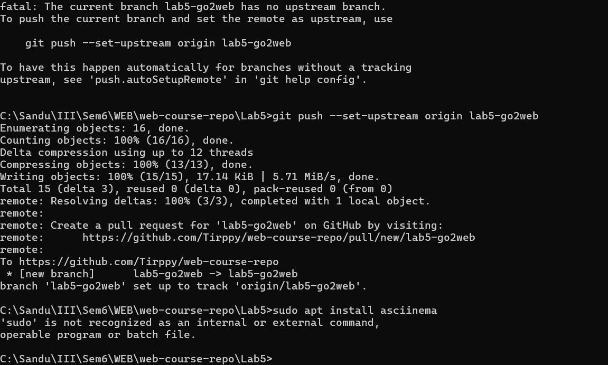

# Lab 5 - go2web

Socket-based CLI browser/search tool for the Web course lab.



## What it does

- `go2web -u <URL>` fetches a page and prints readable text instead of raw HTML
- `go2web -s <search-term>` queries DuckDuckGo HTML search and prints the top 10 results
- `go2web -s <search-term> --open N` fetches the Nth result directly from the CLI
- `go2web -h` prints usage help

## Bonus coverage

- Redirect handling implemented for `301`, `302`, `303`, `307`, `308`
- File cache implemented in `Lab5/.cache/`
- Content negotiation implemented for HTML, JSON, and plain text responses

## Restrictions respected

- No built-in or third-party HTTP client library is used
- Requests are made manually with `socket` and `ssl`
- Output formatting uses parsing logic, not browser rendering

## Project files

- `Lab5/go2web.py` - main application
- `Lab5/go2web` - Unix-style launcher
- `Lab5/go2web.bat` - Windows launcher
- `Lab5/test_go2web.py` - small smoke/unit tests

## Submission checklist

- keep the branch history with multiple meaningful commits instead of only 1-2
- keep the demo GIF in the README
- be ready to show `-h`, `-u`, `-s`, and `--open`
- mention redirects, cache, and content negotiation during the presentation

## Troubleshooting

- if a page looks messy, retry with another URL because some sites render poorly without JavaScript
- if you see `[cached]`, the response was reused from `Lab5/.cache/`
- if you want a fresh fetch during demos, delete the matching files from `Lab5/.cache/`

## Run

Windows PowerShell:

```powershell
.\Lab5\go2web.bat -h
.\Lab5\go2web.bat -u https://example.com
.\Lab5\go2web.bat -s "web sockets"
```

Python directly:

```bash
python Lab5/go2web.py -h
python Lab5/go2web.py -u https://api.github.com
python Lab5/go2web.py -s "web sockets" --open 1
```

## Test

```bash
python -m unittest Lab5/test_go2web.py
```
